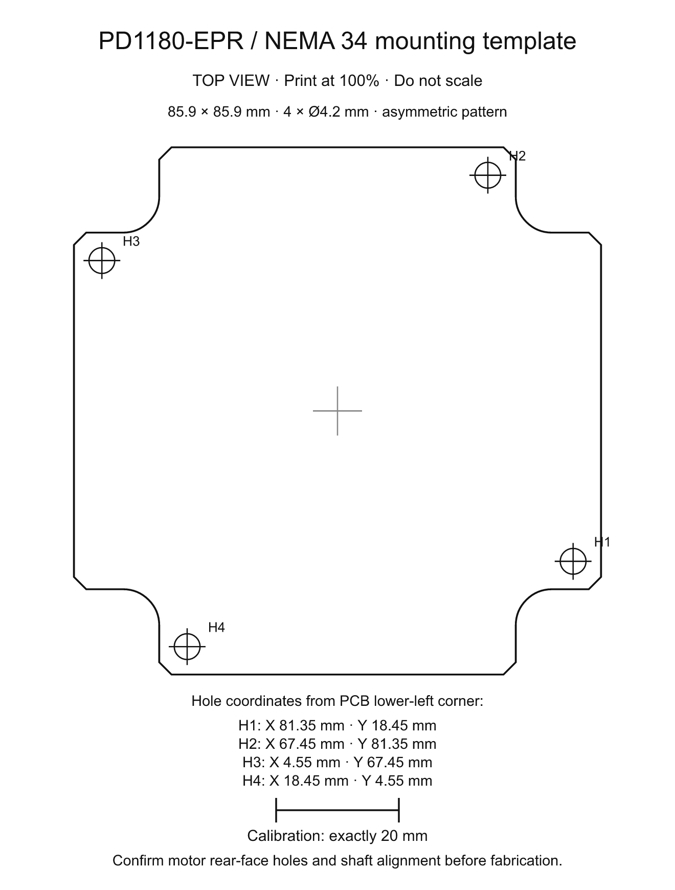

# PD1180-EPR — NEMA 34 Smart Motor-Mounted Stepper Controller with USB-C PD 3.1 EPR

PD1180-EPR is an 85.9 × 85.9 mm, four-layer controller designed around the QSH8618-96-55-700 NEMA 34 stepper motor target. The actual motor and driven load still need confirmation. J1 is the dedicated 48 V / 5 A USB Power Delivery 3.1 EPR input; J10 is a separate USB 2.0 device-data port. The board combines protected power entry, a TMC5160A external-MOSFET motor stage, STM32G0B1 control, magnetic position feedback and industrial control interfaces.

**Revision:** r0.4 reference ECO · **Status:** CAD routing verified; powered validation pending · **Assembly:** top only · **Order status:** HOLD

**Reference-board changes:** Retain the separate PD POWER / USB DATA ports, industrial J7 harness and TMC5160 external bridges. Add TMP102 hardware temperature inhibit, INA240 phase-current diagnostics, ADS1115 bus telemetry and a DATA-powered logic supply. Place bootstrap/gate/bypass parts locally and preserve Kelvin connections to the shunt terminals. Native routing, DRC, schematic parity, ERC and Kelvin isolation pass. Physical USB power validation remains open. The STM32 commissioning firmware is motion-locked. TI programming and powered tests are also pending.

[View the board on tscircuit](https://tscircuit.com/techmannih/NEMA-34-Smart-Motor-Mounted-Stepper-Controller) · [Open the manufacturing release](release/) · [Read the reviewer checklist](docs/reviewer-checklist.md)

The preview shows the routed r0.4 ECO bare PCB. The release archives are regenerated for engineering review. Ordering remains on hold; the commissioning firmware keeps motion locked pending TI programming and powered validation.


## What must arrive with the assembled board

The intended purchase is **PCB fabrication plus complete assembly, programming and functional test**, so the delivered PCBA can operate with its specified motor, power source and harness. Bare-PCB electrical testing and soldering the components do not establish motor operation. Programming and powered testing must be explicitly included in the accepted assembly/test work order; they are not assumed to be included in an SMT assembly quote.

**The current release cannot yet deliver a ready-to-run motor controller.** No assembled hardware has been tested. U3's TI PD image is missing, and the supplied STM32 commissioning image deliberately blocks motor power and motion, including after `ARM`. The following deliverables are required before accepting a board as ready to run:

| Deliverable | Required handoff / present status |
|---|---|
| Complete populated PCBA | Matching Gerbers, BOM and CPL; 295 fitted parts on top, including an agreed through-hole/tall-part assembly plan. CAD verified; assembly not ordered. |
| U3 PD-controller EEPROM | Approved TI-generated TPS26750 full-flash binary, SHA-256 and programming/readback record. **Binary pending.** The requirements JSON is not flashable firmware. |
| U16 STM32 firmware | Board-specific, motor-enabled firmware with a recorded hash and validated motor/current settings. **Only motion-locked commissioning firmware is supplied today.** |
| Functional acceptance | Board serial number, firmware/configuration hashes and measured rail, PD, motor, fault and thermal results. **All powered results pending.** |
| External system | Confirmed motor, EPR source/cable, 24 V control source, mating harnesses, brake resistor/heatsink, magnet and mounting hardware; these are outside the populated-PCB BOM. |

First articles need staged engineering qualification using [the power-validation test matrix](docs/power-validation.md), followed by an agreed per-board acceptance test for the assembled batch. If the assembler does not provide programming or motor testing, arrange a separate commissioning provider before calling the delivery ready to run. The manufacturing request and pending programming fields are in [order-settings.json](release/order-settings.json); detailed acceptance requirements are in [assembly.md](docs/assembly.md).

## Connections and operation

The selected operating mode is **external STEP/DIR with USB setup and diagnostics**. The STM32 supervises power, configures the TMC5160A and checks faults. External pulses pass through the 24 V input circuitry to the TMC5160A, which drives the external MOSFET bridges and regulates the motor phase currents. USB DATA alone cannot power the motor. Industrial transceivers are fitted, but CANopen, serial motion commands and closed-loop positioning are not implemented in the current firmware.

Make motor/brake/harness connections with power removed and the bus discharged. Identify each motor winding from its verified pinout or a resistance measurement; wire colours are not a pinout.

| Connection | Wiring |
|---|---|
| J1 **PD POWER** | Source explicitly supporting a 48 V / 5 A EPR contract, with a suitable 5 A EPR cable. A USB-C connector alone does not establish this capability. |
| J10 **USB DATA** | USB data cable to the setup/diagnostics host. Its independent 5 V input supplies MCU logic, not VMOTOR. |
| J2 **MOTOR** | Pin 1 A1, pin 2 A2 (one winding); pin 3 B1, pin 4 B2 (the other winding). Never connect/disconnect the motor while powered. |
| J3 **BRAKE** | The selected resistor connects between pin 1 VMOTOR and pin 2 switched BRAKE_RETURN. Pin 2 is not a permanent ground. Fit the reviewed heatsink. |
| J7 **STEP/DIR** | Pin 6 STEP, pin 7 DIR, pin 18 hardware ENABLE; nominal 24 V inputs referenced to pin 8 GND. Use a compatible 24 V controller/level interface; do not treat these as direct 3.3 V GPIO inputs. |
| J7 **limits** | Pin 1 HOME, pin 2 STOP L, pin 3 STOP R. Qualify their polarity and stop response during commissioning. Full industrial pinout is below. |
| J7 pin 17 | Protected **VMOTOR, nominal 48 V**; not a 24 V control supply. Obtain the control-input 24 V supply separately. |

Use the physical pin-1 marker and numbered footprint, not the apparent left/right order of a photograph. The STEP/DIR transistor inputs invert their signals; validate step edge, direction setup/hold time and maximum pulse rate at the TMC5160A before configuring the external motion controller.

### First start with the supplied commissioning firmware

1. Complete the unpowered inspection in [bring-up.md](docs/bring-up.md). Keep J1 and the motor disconnected and hardware enable inactive for the initial J10 diagnostic check.
2. If U16 has not been programmed, use ST-LINK/SWD with SWDIO, SWCLK, NRST, GND and the board's 3.3 V reference. Program the verified `firmware.bin` from [the commissioning archive](release/pd1180-commissioning-firmware.zip) at `0x08000000`, verify and reset. Follow [firmware/README.md](firmware/README.md) for the exact MCU and power arrangement. This binary belongs in U16, not U3.
3. Connect J10 and open its USB CDC serial port. Send `HELP`, `STATUS`, `DRIVER` or `DISARM`, each followed by a newline. With J10 alone, `BOARD_OK=0` is expected because the PD-powered peripherals are off; `RUN=0` and `BRINGUP_REQUIRED=1` must remain set as shown.
4. `ARM` currently returns `BLOCKED: ECO hardware and TI configuration not verified`. This is expected, not a wiring workaround. Do not bypass the lock or bridge an enable signal to make the motor run.
5. Commission U3 and the J1 power path with the approved TI image and instrumented, staged tests before connecting a motor. Then qualify a motor-enabled STM32 release, initially below 1 A RMS and only increasing current after gate, current and thermal measurements pass. **This qualification has not happened yet.**

### Normal use after the motor-enabled release is qualified

Connect the confirmed motor, brake and industrial harness while unpowered, with STEP pulses stopped and hardware enable inactive. Connect J10 for diagnostics and J1 for motor power. Verify the approved PD contract, board/driver rails and fault status, select the qualified current/microstep settings, then explicitly arm and assert external enable. Apply a low-rate STEP train with DIR stable; increase speed and load only within the recorded operating envelope. Pulse frequency sets speed and DIR selects direction; the current setting is independent of pulse frequency.

To stop normally, decelerate the STEP train using the validated stop profile, remove enable and disarm before removing power. A fault, reset or power interruption must leave the bridge inhibited and require deliberate re-arming. Loss of torque is not a mechanical holding brake; a gravity-loaded axis needs its own holding arrangement. The final motor-enabled release must supply its exact command/settings procedure and measured operating limits; the commissioning image above cannot execute this normal-use sequence.

## Feature overview

| Area | Implementation |
|---|---|
| USB-C power | TPS26750 sink-only USB PD 3.1 EPR controller requesting 48 V / 5 A |
| USB ports | J1 PD POWER and J10 USB DATA; separate VBUS rails |
| USB protection | TPD4S480 on PD CC/SBU; USBLC6-4SC6 on DATA D+/D−/CC, independent 5.1 kΩ CC pulldowns and DATA VBUS sensing |
| Input protection | TPS26631 eFuse, inrush control, voltage qualification, current limit and reverse-current blocking |
| Motor stage | TMC5160A with eight 100 V CSD19534Q5A MOSFETs and two 33 mΩ phase shunts |
| Motor target | QSH8618-96-55-700, 5.5 A RMS phase current, 7.0 Nm holding torque |
| Controller | STM32G0B1CBT6 with USB device, CAN, SPI, I²C and serial peripherals |
| Position feedback | Top-side AS5047P magnetic encoder at the shaft axis, with ABI test access |
| Temperature/current diagnostics | TMP102 hardware inhibit; two INA240 phase monitors; ADS1115 bus monitors |
| Motion inputs | 24 V Step/Dir plus HOME, left stop and right stop inputs |
| Communications | USB 2.0, CAN, RS485 and RS232 |
| Outputs | Hardware enable plus two protected low-side outputs |
| Braking | External switched brake-resistor interface with independent overvoltage shutdown |
| Programming | SWD for STM32 and configuration EEPROM for the PD controller |
| Assembly | 295 JLC-sourced fitted parts plus 11 service test pads, all on top |

The board powers up inhibited. A valid EPR contract, eFuse status, motor-power-good signal, voltage window, external hardware enable and MCU request must all agree before the bridge can run. Reset defaults keep `POWER_PERMIT`, `MCU_RUN`, `RS485_DE`, both protected outputs and standalone-mode selection inactive.

## Power architecture

```text
J1 PD POWER VBUS -> reverse blocking / eFuse -> VMOTOR -> bridge power / TMC5160 VS
        |                                       |       motor J2 / brake J3
        |                                       +-> U34 12 V -> TMC5160 VSA/12VOUT
        +-> U5 3.3 V startup supply              +-> U22 3.3 V brake-control backup
                         U23 / U24 reverse-blocked OR -> V3V3
J1 CC1/2 -> U1 protection -> U2 TPS26750 EPR controller
J10 USB DATA D+/D- -> D15 shunt ESD -> R71/R72 -> STM32 USB
J10 VBUS -> U28 current limiter -> U25 LDO -> V3V3_USB
board V3V3 / V3V3_USB -> U26 / U27 reverse-blocked OR -> V3V3_MCU
```

DATA alone powers MCU setup/diagnostics on V3V3_MCU. Industrial interfaces, flash, encoder and sensors remain on board V3V3 supplied by J1/VMOTOR. Open-drain chip selects and inactive peripheral pins prevent MCU-driven backfeed. Firmware now implements USB suspend with STOP0, watchdog wake and fresh power/sensor qualification after resume; measured current, inrush, wake timing and source handovers remain unverified. U22 retains VMOTOR-fed brake control. The commissioning image keeps the motor locked.

The requested contract is 240 W. The nominal eFuse current limit is approximately 4.48 A, so the board-side motor input limit is about 215 W at 48 V before conversion and switching losses. USB input current and phase current are different quantities; the motor-stage target is 5.5 A RMS per phase.

The 940 µF motor bulk bank stores only about 0.188 J between 48 V and the revised nominal 51.99 V brake turn-on threshold. It cannot absorb sustained regeneration. J3 connects a separately selected braking resistor and heatsink; 10 Ω / 300 W is an initial engineering target, not a validated load rating. Actual speed, attached inertia, stopping time and duty cycle determine the final resistor and thermal design. U34 now supplies the driver separately at nominal 12 V; see [the power ECO calculations and remaining tests](docs/power-validation.md).

Detailed calculations, tolerances and protection behavior are recorded in [docs/design.md](docs/design.md). The separate CC, USB-data and current-monitor paths are traced pin by pin in [docs/usb-pd-architecture.md](docs/usb-pd-architecture.md).

## Motor control and feedback

The TMC5160A controls two external MOSFET bridges. Four bootstrap capacitors, charge-pump support, gate resistors, local driver rails and two 3 W current shunts are represented explicitly. Native ramp control selects the board's limit inputs. External STEP/DIR is the selected product mode. The former encoder/mode-pin conflict is corrected in the ECO source; motion stays inhibited until native and powered validation pass.

The top-side AS5047P shares SPI with the motor driver and external flash, using an independent chip-select. Its ABI outputs are available on five top service pads for probing. The board assumes a diametrically magnetized shaft magnet aligned to the sensor axis; magnet diameter, gap, runout and stray-field behavior remain mechanical validation items.

Firmware must configure current scaling, gate drive, dead time, chopper behavior, motion limits and encoder calibration for the actual motor. A register default is not approval for 5.5 A operation.

## Interfaces

| Connector | Function | Pins / notes |
|---|---|---|
| J1 | PD POWER | 48 V / 5 A requested EPR contract; CC/SBU protection; no data connection |
| J10 | USB DATA | USB 2.0 D+/D−, independent CC pulldowns, ESD and VBUS attach sense |
| J2 | Motor | A1, A2, B1, B2 |
| J3 | External brake | VMOTOR and switched resistor return |
| J7 | Industrial harness | 20-pin keyed JST PHD carrying all former J6/J7/J9 signals |

J7 pinout: 1 HOME, 2 STOP L, 3 STOP R, 4 IN0, 5 IN1, 6 STEP, 7 DIR, 8 GND, 9 RS232 TX, 10 RS232 RX, 11 GND, 12 CAN H, 13 CAN L, 14 GND, 15 RS485 A, 16 RS485 B, 17 **VMOTOR (48 V nominal)**, 18 hardware enable, 19 OUT0, 20 OUT1. Inputs remain 24 V nominal. This harness is not pin-compatible with the previous headers; pin17 is not a regulated 24 V output. Use the numbered physical pin map in `hardware-contract.json` when making the cable.

CAN and RS485 remain non-isolated. Termination and RS485 bias belong at the system level. SWD/reset/status and encoder ABI signals remain on labelled top-side service pads. There are five cable connectors, with all industrial features retained.

## Firmware contract

The generated STM32 pin contract lives in [docs/firmware-pinmap.json](docs/firmware-pinmap.json) and [firmware/include/board_pins.h](firmware/include/board_pins.h). The shared safety logic has host tests; the pinned PlatformIO target builds a flashable USB commissioning image with motor outputs locked pending the ECO validation. See [firmware build/programming instructions](firmware/README.md).

| Function | MCU signals |
|---|---|
| Motor SPI | `TMC_CS_N`, `SPI_SCK`, `SPI_MISO`, `SPI_MOSI`, `TMC_DIAG0`, `TMC_DIAG1` |
| Encoder/flash | `ENC_CS_N`, `FLASH_CS_N` on the shared SPI bus |
| USB | `USB_VBUS_SENSE`, `USB_DM`, `USB_DP` |
| Power safety | `BOARD_POWER_SENSE`, `EFUSE_FAULT_N`, `MOTOR_PG`, `VMOTOR_OK`, `POWER_PERMIT`, `MCU_RUN` |
| Motion inputs | `STEP_IN`, `DIR_IN`, `STOP_L`, `STOP_R`, `HOME_IN` |
| Communications | CAN RX/TX, RS485 RX/TX/DE and RS232 RX/TX |
| Monitoring | `PHASE_A_ADC` / `PHASE_B_ADC` on PA0/PA1; ADS1115 bus monitoring and TMP102 temperature on I²C |

The motor-qualified STM32 firmware and TI-generated TPS26750 full-flash image are release inputs. Reset circuitry is designed to inhibit the board with blank U3 and U16; that behavior still requires a powered test. Programming both devices is necessary but does not, by itself, establish motor readiness. The current STM32 image remains motion-locked even if U3 is programmed.

U16 remains STM32G0B1 because this board uses its native USB device, FDCAN, ADC, SPI, I²C, UART and SWD peripherals at the same time. RP2040 is not a drop-in substitute and has no native CAN controller; changing to it would add a CAN controller and require a new pin map, firmware target, placement and route. The exact fitted STM32 code `C2847904` is covered by the same live-stock gate as every other fitted part.

## Schematic organization

The design is split into sixteen functional sheets:

| Sheet | Scope |
|---|---|
| USB PD | Dedicated J1 power receptacle, CC/SBU protection, PD controller and EEPROM |
| USB DATA | J10 USB 2.0, CC pulldowns, ESD and VBUS attach sensing |
| Logic power | USB-side and motor-side buck supplies with reverse-blocked rail ORing |
| Motor power | eFuse, reverse blocking, bulk capacitance and motor-bus qualification |
| Driver power | U34 regulated 12 V supply for TMC5160 VSA/12VOUT and brake-gate drive |
| Motion | TMC5160A control, mode selection, limit inputs and encoder interface |
| Bridge A / Bridge B | External MOSFET half-bridges, bootstrap networks and phase shunts |
| Brake | Bus-voltage comparators, brake MOSFET drive and external resistor connector |
| MCU | STM32G0B1, clock, reset, SWD, flash and shared control buses |
| Encoder | Top-side AS5047P supply, SPI/ABI signals and service test pads |
| USB logic | DATA current limiter, 3.3 V LDO and reverse-blocking source selection |
| Telemetry | Temperature inhibit, phase-current amplifiers and bus-monitor ADC |
| Inputs | 24 V Step/Dir, stop, home and digital input conditioning |
| Outputs | Protected low-side outputs and hardware enable chain |
| Serial | CAN, RS485 and RS232 transceivers with ESD support |

The source and regenerated release contain sixteen schematic sheets.

## PCB, mechanics and assembly

| Property | r0.4 ECO value |
|---|---:|
| Board outline | 85.9 × 85.9 mm TMCM-1180 V1.1 stepped perimeter with four concave 5.9 mm arcs |
| Copper layers | 4 |
| Finished thickness | 1.6 mm |
| Copper weight | 1 oz on every layer |
| Mounting | Four 4.2 mm holes on the documented asymmetric motor pattern |
| Power corridor | Nominal 2.4 mm with 0.16 mm zone clearance |
| General/power via | 0.60 mm pad / 0.30 mm finished drill |
| MOSFET drain-pad thermal vias | 40 total: four 0.60/0.30 mm through vias under each of ten CSD19534Q5A drain pads; epoxy filled and copper capped |
| Dense signal via | 0.50 mm pad / 0.30 mm finished drill |
| Minimum via drill | 0.30 mm throughout the source, routed board and manufacturing exports; no smaller-drill exceptions |
| Assembly side | Top only |
| Solder mask / legend | Green / white |

All fitted components, including the centered encoder, its local bypass parts, logic power and labelled service pads, are on top. No bottom paste is required. The bottom carries the `ts` and `Made with tscircuit` board marking and remains available for copper routing. Bulk capacitors and through-hole headers may require selective or hand soldering. The encoder magnet gap and orientation require physical validation after this assembly-side change.

The completed KiCad route passes all-severity DRC, connectivity, schematic parity, ERC and terminal-only Kelvin checks. Nominal power-zone coverage is measured by routed length on the matching net/layer, independent of trace splitting. Clipped necks and temperature rise still need powered validation. The nominal 2.4 mm / 1 oz external-layer IPC-2221 estimate is 6.12 A at a 20 °C rise; it does not validate clipped pours or the thermal performance of a finished board.

The printable [mounting template](mounting-template.svg) is generated from `hardware-contract.json` plus the hash-locked TMCM-1180 V1.1 STEP extraction in `engineering/tmcm-1180-v11-mechanical-reference.json`. It includes the exact stepped perimeter, asymmetric holes and a 20 mm calibration bar. Print it at 100% and confirm all four rear-face holes and the shaft axis against the actual motor before ordering.



## Parts and procurement

- 295 populated components use exact JLCPCB/LCSC identities.
- The fitted BOM contains 83 unique LCSC codes.
- The latest committed live check reports 83/83 available at its recorded timestamp; refresh stock for the actual order before purchase.
- Eleven selected alternative candidates are currently available.
- TPD4S480 has no approved drop-in replacement; a lower-voltage CC protector is not suitable for 48 V EPR.
- Automatic substitution is disabled. Package, pinout, polarity, voltage, current and thermal limits must be reviewed before any change.

The EPR source, certified 5 A EPR cable, QSH8618 motor, shaft magnet, brake resistor/heatsink, mating housings, contacts, wire and external bus termination are system items outside the assembled PCB BOM. See [docs/procurement.md](docs/procurement.md) and [sourcing/](sourcing/).

## Verification

Run the same fail-closed review used in CI:

```sh
bun install --frozen-lockfile
bun run review
```

The review covers the pinned toolchain, compact tscircuit cloud package, TypeScript, firmware pin contract and host tests, source topology, netlist, the viewer-equivalent schematic style analysis, schematic/PCB placement, decoupling, exact supplier identities, top-side assembly, local critical copper, shorts, native KiCad PCB DRC and schematic ERC, power routing, route fingerprint, live stock, alternatives, preview export, release archives and recursive hashes.

Current verification evidence:

| Gate | Result |
|---|---|
| Native KiCad PCB DRC + schematic ERC | PASS — 0 PCB violations, unconnected nets, parity issues and ERC violations |
| Schematic style | PASS — 0 issues across all viewer analysis categories |
| Topology regression | PASS — 37 tests covering topology, via identity and power-copper geometry |
| Kelvin-check regressions | PASS — 11 native regressions and all 9 final-board paths |
| Decoupling | PASS — 46/46 native IC-to-capacitor paths |
| Assembly | PASS — 295 fitted parts plus 11 service test pads on top |
| Stock | PASS — 83/83 unique fitted LCSC codes available at the recorded timestamp |
| Alternatives | PASS — 11/11 selected candidates available |
| Release delivery | Current ECO review artifacts; ordering remains on hold |
| Route identity | Current source, local constraints and final PCB hash match |
| USB suspend power management | MCU-only rail and STOP0 path implemented; hardware current/timing unverified |

Machine-readable evidence is stored in [docs/verification.json](docs/verification.json), [docs/checks/schematic-style.json](docs/checks/schematic-style.json), [docs/feature-parity-check.json](docs/feature-parity-check.json), [docs/board-standards-check.json](docs/board-standards-check.json), [docs/power-routing-check.json](docs/power-routing-check.json), [docs/stock-report.json](docs/stock-report.json) and [delivery-manifest.json](delivery-manifest.json).

## Manufacturing release

The `release/` payload contains current ECO review files. **Do not order yet:** powered USB, current/thermal and system qualification remain open. Legacy archive filenames retain the r0.3 suffix for tool compatibility; their hardware contract and board markings identify r0.4. The package contains:

- PCB Gerber ZIP and the routed KiCad project ZIP;
- complete manufacturing ZIP with drills, Gerbers, DRC, BOM, CPL and project files;
- JLCPCB BOM and top-side placement CSV;
- ZIP-packaged 3D GLB plus top and bottom renders;
- sixteen schematic-sheet SVGs;
- order settings, hardware contract, schematic-style evidence, power-routing evidence and release status;
- delivery manifest and recursive SHA-256 hashes.

After a new verified release exists, apply its order settings: four layers, 1 oz copper on all layers, 1.6 mm thickness, filled/capped via-in-pad and top-side assembly. Review orientation, polarity, connector direction and the through-hole assembly plan before ordering.

The hosted tscircuit editor opens the complete routed PCB in `release/circuit.json` by default. The authoritative editable source remains `index.circuit.tsx`. Its file selector includes all source TSX files, all imported components under `imports/`, and `release/circuit.json`. The cloud build compiles/transpiles `index.circuit.tsx`, then builds `release/circuit.json` into `dist/release/circuit.json` for the hosted viewer and static site. Imported components remain selectable without each becoming a separate CI board build. Run `bun run check:cloud-package --built` after the cloud build to verify the selected preview exists and exactly matches the routed artifact. Cloud autorouting stays disabled for the source preview.

After pulling updates, run `bun install --frozen-lockfile` and restart `bun run dev`. The dev command checks the installed toolchain before starting. `tscircuit.config.ts` makes interactive previews use the pinned local component definitions and disables preview autorouting, just like the build. This prevents remote pin-metadata requests from holding the main-board render open while another component is selected. Live supplier stock checks still run in `bun run review`.

Run `bun run build:pcb` (also `bun run build`) to refresh the default routed view from the current source. This checks the saved PCB fingerprint, native DRC report and local trace continuity, preserves the schematic exactly, and updates only viewer delivery hashes. Select `index.circuit.tsx` to edit the source and any `imports/` file to inspect that component. `release/circuit.json` is the final routed view. After regeneration it preserves the code-defined 16-sheet schematic and 3D model, then replaces preview copper with the exact traces, vias and filled-zone polygons imported from the final KiCad board. `bun run check:cloud-viewer` regenerates that artifact in memory, checks every routed-port mapping and compares its copper counts with the KiCad import. The GitHub release importer materializes other supported tracked files before starting the CLI, so `bun run check:cloud-package` checks source/import visibility, the configured upload and the larger fixed-filter GitHub payload.

## Repository map

| Path | Purpose |
|---|---|
| `AGENTS.md` | Automatic design and review rules for AI-assisted changes |
| `board-markings.tsx` | Product identity and rear-side tscircuit attribution |
| `feature-parity.tsx` | Machine-checked product feature contract |
| `board-standards.json` | Machine-readable fabrication, via, marking, assembly and delivery policy |
| `hardware-contract.json` | Product dimensions, ratings, controller and reset-safe outputs |
| `mounting-template.svg` | Print-at-100% mechanical fit template generated from the hardware contract |
| `index.circuit.tsx` | Authoritative code-defined circuit, schematic layout and PCB intent |
| `release/circuit.json` | Generated hosted-viewer circuit with source schematic/3D data and verified KiCad copper |
| `engineering/` | Reviewer map linking contracts to generated evidence |
| `imports/` | Locally pinned component models and symbol/footprint corrections |
| `firmware/` | Safety state machine, generated pins and TMC5160A startup configuration |
| `routing/` | Power-copper requirements and guarded route fingerprint |
| `checks/` | Pinned viewer-equivalent review engine used by local and CI checks |
| `docs/` | Design calculations, assembly, procurement, bring-up and verification evidence |
| `scripts/` | Documented generation and fail-closed review tools |
| `sourcing/` | Stock-qualified BOM, alternatives and external-system items |
| `previews/` | Lightweight images used by this README and tscircuit package |
| `dist/` | Generated circuit, schematics, routed PCB and manufacturing outputs |
| `release/` | Engineering review handoff with archive/hash verification; ordering remains on hold |

## Bring-up and remaining gates

The r0.4 ECO files become a prototype fabrication handoff only after the order hold is cleared. Archive and KiCad basenames retain the legacy `r0.3` suffix for pipeline compatibility; the hardware contract, board silkscreen, release status and hashes identify the actual r0.4 ECO revision. They are not a production release. Before applying motor power:

1. Generate and independently review the sink-only TPS26750 EPR configuration, then program U3.
2. Qualify the integrated STM32 target on the bench, verify fault shutdown and produce the motor-enabled release with recorded configuration/hash evidence.
3. Confirm the motor rear-face pattern, shaft magnet alignment, air gap and enclosure clearances.
4. Select the brake resistor/heatsink from measured load inertia, speed and stopping duty.
5. Perform current-limited rail bring-up before fitting the motor.
6. Measure gate waveforms, phase current, bus overshoot, connector temperature and PCB temperature.
7. Complete USB PD, cable-fault, regeneration, ESD, EMC and representative-load testing.

The staged procedure and sign-off points are in [docs/bring-up.md](docs/bring-up.md). Prototype-order gates and physical system-validation gates remain separate in [docs/release-status.json](docs/release-status.json).

Engineering review and ordering are separate gates: `bun run review` validates the current source, CAD, firmware, stock and delivery artifacts while retaining any documented order hold. `bun run check:release` additionally requires `fabrication_orderable: true`; it must fail until the order hold is cleared with evidence. A passing review/CI run is not authorization to order or a claim of powered hardware qualification.
