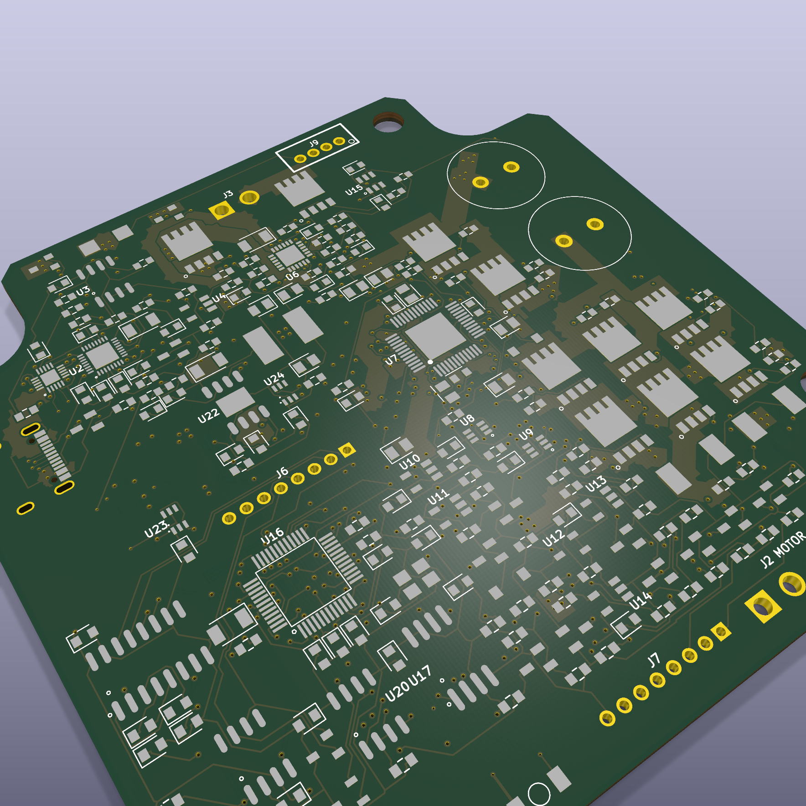
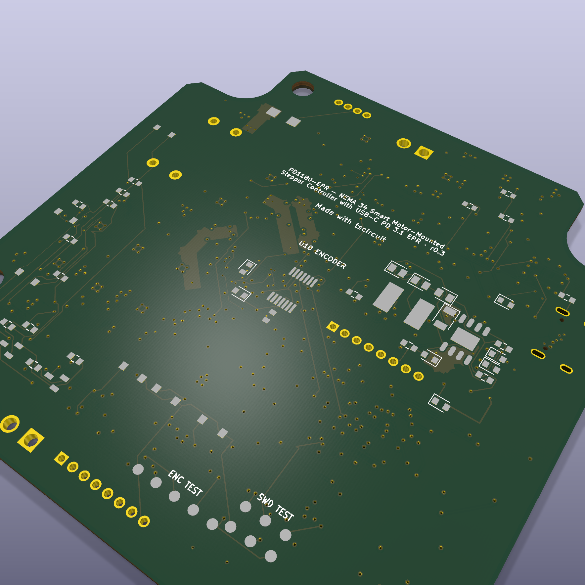

# PD1180-EPR — NEMA 34 Smart Motor-Mounted Stepper Controller with USB-C PD 3.1 EPR

PD1180-EPR is an 85.9 × 85.9 mm, four-layer controller for the QSH8618-96-55-700 NEMA 34 stepper motor. A single J1 USB-C receptacle requests a 48 V / 5 A USB Power Delivery 3.1 EPR contract and carries USB 2.0 device data. The board combines protected power entry, a TMC5160A external-MOSFET motor stage, STM32G0B1 control, magnetic position feedback and industrial control interfaces.

**Revision:** r0.3 · **Status:** prototype engineering release · **Assembly:** top and bottom · **Production validation:** open

[View the board on tscircuit](https://tscircuit.com/techmannih/NEMA-34-Smart-Motor-Mounted-Stepper-Controller) · [Open the manufacturing release](release/) · [Read the reviewer checklist](docs/reviewer-checklist.md)



| Top assembly | Bottom assembly and board marking |
|---|---|
|  |  |

## Feature overview

| Area | Implementation |
|---|---|
| USB-C power | TPS26750 sink-only USB PD 3.1 EPR controller requesting 48 V / 5 A |
| USB port | Combined J1 EPR power and USB 2.0 data receptacle |
| USB protection | TPD4S480 CC/data protection and 5–60 V-tolerant VBUS sensing |
| Input protection | TPS26631 eFuse, inrush control, voltage qualification, current limit and reverse-current blocking |
| Motor stage | TMC5160A with eight 100 V CSD19534Q5A MOSFETs and two 33 mΩ phase shunts |
| Motor target | QSH8618-96-55-700, 5.5 A RMS phase current, 7.0 Nm holding torque |
| Controller | STM32G0B1CBT6 with USB device, CAN, SPI, I²C and serial peripherals |
| Position feedback | Bottom-side AS5047P magnetic encoder at the shaft axis, with ABI test access |
| Motion inputs | 24 V Step/Dir plus HOME, left stop and right stop inputs |
| Communications | USB 2.0, CAN, RS485 and RS232 |
| Outputs | Hardware enable plus two protected low-side outputs |
| Braking | External switched brake-resistor interface with independent overvoltage shutdown |
| Programming | SWD for STM32 and configuration EEPROM for the PD controller |
| Assembly | 254 JLC-sourced fitted parts plus 11 service test pads, split across top and bottom |

The board powers up inhibited. A valid EPR contract, eFuse status, motor-power-good signal, voltage window, external hardware enable and MCU request must all agree before the bridge can run. Reset defaults keep `POWER_PERMIT`, `MCU_RUN`, `RS485_DE`, both protected outputs and standalone-mode selection inactive.

## Power architecture

```text
USB-C J1 ── VBUS/CC ── TPD4S480 ── TPS26750 ── TPS26631 ── VMOTOR
       │                                      │                │
       ├── D+/D− ──── TPD4S480 ──────────────┼──────────── STM32 USB
       └── VBUS ───── 1 MΩ / 47 kΩ divider ──┘                ├── TMC5160A + external H bridges
                                                              ├── motor connector J2
                                                              └── external brake connector J3
                 USB-side 3.3 V buck ────────┼── ideal-diode OR ── V3V3
                 motor-side 3.3 V buck ──────┘
```

The requested contract is 240 W. The nominal eFuse current limit is approximately 4.48 A, so the board-side motor input limit is about 215 W at 48 V before conversion and switching losses. USB input current and phase current are different quantities; the motor-stage target is 5.5 A RMS per phase.

The motor bulk bank stores only about 0.237 J between 48 V and the nominal 53 V brake threshold. It cannot absorb sustained regeneration. J3 connects a separately selected braking resistor and heatsink; 10 Ω / 300 W is an initial engineering target, not a validated load rating. Actual speed, attached inertia, stopping time and duty cycle determine the final resistor and thermal design.

Detailed calculations, tolerances and protection behavior are recorded in [docs/design.md](docs/design.md). The separate CC, USB-data and current-monitor paths are traced pin by pin in [docs/usb-pd-architecture.md](docs/usb-pd-architecture.md).

## Motor control and feedback

The TMC5160A controls two external MOSFET bridges. Four bootstrap capacitors, charge-pump support, gate resistors, local driver rails and two 3 W current shunts are represented explicitly. Native ramp control can select the board's limit inputs; Step/Dir mode selects the external conditioned inputs.

The bottom-side AS5047P shares SPI with the motor driver and external flash, using an independent chip-select. Its ABI outputs are available on five bottom service pads for probing. The board assumes a diametrically magnetized shaft magnet aligned to the sensor axis; magnet diameter, gap, runout and stray-field behavior remain mechanical validation items.

Firmware must configure current scaling, gate drive, dead time, chopper behavior, motion limits and encoder calibration for the actual motor. A register default is not approval for 5.5 A operation.

## Interfaces

| Connector | Function | Pins / notes |
|---|---|---|
| J1 | USB-C EPR power + data | 48 V / 5 A requested contract, USB 2.0 D+/D− and 5–60 V-tolerant VBUS attach sensing; shell bonded to ground |
| J2 | Motor | A1, A2, B1, B2 |
| J3 | External brake | VMOTOR and switched resistor return |
| J6 | Serial buses | RS232 TX/RX, CAN H/L, RS485 A/B and grounds |
| J7 | Machine inputs | HOME, STOP L, STOP R, IN0, IN1, 24 V STEP, 24 V DIR and GND |
| J9 | Outputs and enable | **48 V VMOTOR**, hardware enable, OUT0 and OUT1 |

CAN and RS485 are non-isolated. Termination and RS485 bias belong at the system level. J9 exposes the motor bus; it is not a regulated 24 V accessory output.

SWD, reset/status and encoder ABI signals use labelled bottom-side service pads instead of three extra cable connectors. This keeps field connectors limited to one USB-C port, motor, brake, serial, machine I/O and output/enable interfaces.

## Firmware contract

The generated STM32 pin contract lives in [docs/firmware-pinmap.json](docs/firmware-pinmap.json) and [firmware/include/board_pins.h](firmware/include/board_pins.h). The host-testable safety state machine keeps the board reviewable without requiring an embedded toolchain.

| Function | MCU signals |
|---|---|
| Motor SPI | `TMC_CS_N`, `SPI_SCK`, `SPI_MISO`, `SPI_MOSI`, `TMC_DIAG0`, `TMC_DIAG1` |
| Encoder/flash | `ENC_CS_N`, `FLASH_CS_N` on the shared SPI bus |
| USB | `USB_VBUS_SENSE`, `USB_DM`, `USB_DP` |
| Power safety | `PD_IRQ_N`, `EFUSE_FAULT_N`, `MOTOR_PG`, `VMOTOR_OK`, `POWER_PERMIT`, `MCU_RUN` |
| Motion inputs | `STEP_IN`, `DIR_IN`, `STOP_L`, `STOP_R`, `HOME_IN` |
| Communications | CAN RX/TX, RS485 RX/TX/DE and RS232 RX/TX |
| Monitoring | `VMON_ADC`, `IIN_MON`, status GPIO |

The STM32 target peripheral port and TI-generated TPS26750 full-flash image are release inputs. The assembled board is intentionally safe with blank U3 and U16, but it cannot negotiate 48 V or run the motor until both devices are programmed.

U16 remains STM32G0B1 because this board uses its native USB device, FDCAN, ADC, SPI, I²C, UART and SWD peripherals at the same time. RP2040 is not a drop-in substitute and has no native CAN controller; changing to it would add a CAN controller and require a new pin map, firmware target, placement and route. The exact fitted STM32 code `C2847904` is covered by the same live-stock gate as every other fitted part.

## Schematic organization

The design is split into twelve A4 functional sheets:

| Sheet | Scope |
|---|---|
| USB PD/data | Separate power/data receptacles, CC/data protection, PD controller, configuration EEPROM and data-port attach sensing |
| Logic power | USB-side and motor-side buck supplies with reverse-blocked rail ORing |
| Motor power | eFuse, reverse blocking, bulk capacitance and motor-bus qualification |
| Motion | TMC5160A control, mode selection, limit inputs and encoder interface |
| Bridge A / Bridge B | External MOSFET half-bridges, bootstrap networks and phase shunts |
| Brake | Bus-voltage comparators, brake MOSFET drive and external resistor connector |
| MCU | STM32G0B1, clock, reset, SWD, flash and shared control buses |
| Encoder | Bottom-side AS5047P supply, SPI/ABI signals and service test pads |
| Inputs | 24 V Step/Dir, stop, home and digital input conditioning |
| Outputs | Protected low-side outputs and hardware enable chain |
| Serial | CAN, RS485 and RS232 transceivers with ESD support |

Rendered SVG and PNG sheets are available under `dist/schematics/`; the release package contains the twelve SVG sheets.

## PCB, mechanics and assembly

| Property | r0.3 value |
|---|---:|
| Board outline | 85.9 × 85.9 mm TMCM-1180 V1.1 stepped perimeter with four concave 5.9 mm arcs |
| Copper layers | 4 |
| Finished thickness | 1.6 mm |
| Copper weight | 1 oz on every layer |
| Mounting | Four 4.2 mm holes on the documented asymmetric motor pattern |
| Power corridor | Nominal 2.4 mm with 0.16 mm zone clearance |
| General/power via | 0.60 mm pad / 0.30 mm finished drill |
| MOSFET drain-pad thermal vias | 40 total: four 0.60/0.30 mm through vias under each of ten CSD19534Q5A drain pads; epoxy filled and copper capped |
| Dense signal via | 0.45 mm pad / 0.20 mm finished drill |
| Dense signal exception | Sixteen 0.40/0.20 mm holes, filled and capped |
| Assembly side | Top and bottom |
| Solder mask / legend | Green / white |

Tall power parts and all field connectors remain on top. The centered encoder, its local bypass parts, low-profile logic power and labelled service pads are on the bottom. Bottom paste is therefore required. The bottom also carries the `ts` and `Made with tscircuit` board marking. Bulk capacitors and through-hole headers may require selective or hand soldering.

The current KiCad route passes with zero DRC violations and zero unconnected items. Power nets use reinforced copper corridors and parallel transfer vias. The 1 oz external-layer IPC-2221 screening result is 6.12 A at a 20 °C rise; enclosure temperature, layer sharing, neck-down regions, connector heating and switching losses still require powered thermal measurements.

The printable [mounting template](mounting-template.svg) is generated from `hardware-contract.json` plus the hash-locked TMCM-1180 V1.1 STEP extraction in `engineering/tmcm-1180-v11-mechanical-reference.json`. It includes the exact stepped perimeter, asymmetric holes and a 20 mm calibration bar. Print it at 100% and confirm all four rear-face holes and the shaft axis against the actual motor before ordering.


## Parts and procurement

- 254 populated components use exact JLCPCB/LCSC identities.
- The fitted BOM contains 66 unique LCSC codes.
- The latest committed live check reports 66/66 available.
- Eleven selected alternative candidates are currently available.
- TPD4S480 has no approved drop-in replacement; a lower-voltage CC protector is not suitable for 48 V EPR.
- Automatic substitution is disabled. Package, pinout, polarity, voltage, current and thermal limits must be reviewed before any change.

The EPR source, certified 5 A EPR cable, QSH8618 motor, shaft magnet, brake resistor/heatsink, mating housings, contacts, wire and external bus termination are system items outside the assembled PCB BOM. See [docs/procurement.md](docs/procurement.md) and [sourcing/](sourcing/).

## Verification

Run the same fail-closed review used in CI:

```sh
bun install --frozen-lockfile
bun run review
```

The review covers the pinned toolchain, compact tscircuit cloud package, TypeScript, firmware pin contract and host tests, source topology, netlist, the viewer-equivalent schematic style analysis, schematic/PCB placement, decoupling, exact supplier identities, two-sided assembly, local critical copper, shorts, KiCad DRC, power routing, route fingerprint, live stock, alternatives, preview export, release archives and recursive hashes.

Current committed results:

| Gate | Result |
|---|---|
| KiCad DRC | PASS — 0 violations, 0 unconnected items |
| Schematic style | PASS — 0 issues across all viewer analysis categories |
| Topology regression | PASS — 14 tests, 631 assertions |
| Decoupling | PASS — 32/32 targets |
| Assembly | PASS — 254 supplier-backed parts plus 11 service test pads on permitted layers |
| Stock | PASS — 66/66 unique fitted LCSC codes available at the recorded timestamp |
| Alternatives | PASS — 11/11 selected candidates available |
| Release delivery | PASS — 35 required files, 4 ZIP archives, 34 recursive SHA-256 entries |
| Route identity | PASS — source topology/placement and routed KiCad hashes match |

Machine-readable evidence is stored in [docs/verification.json](docs/verification.json), [docs/checks/schematic-style.json](docs/checks/schematic-style.json), [docs/feature-parity-check.json](docs/feature-parity-check.json), [docs/board-standards-check.json](docs/board-standards-check.json), [docs/power-routing-check.json](docs/power-routing-check.json), [docs/stock-report.json](docs/stock-report.json) and [delivery-manifest.json](delivery-manifest.json).

## Manufacturing release

The `release/` directory contains:

- PCB Gerber ZIP and the routed KiCad project ZIP;
- complete manufacturing ZIP with drills, Gerbers, DRC, BOM, CPL and project files;
- JLCPCB BOM and two-sided placement CSV;
- ZIP-packaged 3D GLB plus top and bottom renders;
- twelve schematic-sheet SVGs;
- order settings, hardware contract, schematic-style evidence, power-routing evidence and release status;
- delivery manifest and recursive SHA-256 hashes.

Apply every value in [release/order-settings.json](release/order-settings.json), especially four layers, 1 oz copper on all layers, 1.6 mm thickness, filled/capped via-in-pad and top/bottom assembly. Review component orientation, polarity, connector direction and the through-hole assembly plan in the JLC viewer before submitting the order.

The hosted tscircuit entrypoint is the generated `release/circuit.json`. It preserves the code-defined 12-sheet schematic and 3D model, then replaces preview copper with the exact traces, vias and filled-zone polygons imported from the final KiCad board. `bun run check:cloud-viewer` regenerates that artifact in memory, checks 926/926 routed-port mappings and compares its copper counts with the KiCad import. Cloud autorouting remains disabled because the verified route is already present and recomputing this board can time out. The GitHub release importer materializes other supported tracked files before starting the CLI, so `bun run check:cloud-package` checks both the configured 8 MiB viewer source set and the larger fixed-filter GitHub payload.

## Repository map

| Path | Purpose |
|---|---|
| `AGENTS.md` | Automatic design and review rules for AI-assisted changes |
| `board-markings.tsx` | Product identity and rear-side tscircuit attribution |
| `feature-parity.tsx` | Machine-checked product feature contract |
| `board-standards.json` | Machine-readable fabrication, via, marking, assembly and delivery policy |
| `hardware-contract.json` | Product dimensions, ratings, controller and reset-safe outputs |
| `mounting-template.svg` | Print-at-100% mechanical fit template generated from the hardware contract |
| `index.circuit.tsx` | Authoritative code-defined circuit, schematic layout and PCB intent |
| `release/circuit.json` | Generated hosted-viewer circuit with source schematic/3D data and verified KiCad copper |
| `engineering/` | Reviewer map linking contracts to generated evidence |
| `imports/` | Locally pinned component models and symbol/footprint corrections |
| `firmware/` | Safety state machine, generated pins and TMC5160A startup configuration |
| `routing/` | Power-copper requirements and guarded route fingerprint |
| `checks/` | Pinned viewer-equivalent review engine used by local and CI checks |
| `docs/` | Design calculations, assembly, procurement, bring-up and verification evidence |
| `scripts/` | Documented generation and fail-closed review tools |
| `sourcing/` | Stock-qualified BOM, alternatives and external-system items |
| `previews/` | Lightweight images used by this README and tscircuit package |
| `dist/` | Generated circuit, schematics, routed PCB and manufacturing outputs |
| `release/` | Orderable prototype handoff with archive and hash verification |

## Bring-up and remaining gates

The r0.3 files are a prototype fabrication handoff after the committed release checks pass. They are not a production release. Before applying motor power:

1. Generate and independently review the sink-only TPS26750 EPR configuration, then program U3.
2. Integrate the STM32 target firmware and verify immediate fault shutdown on the bench.
3. Confirm the motor rear-face pattern, shaft magnet alignment, air gap and enclosure clearances.
4. Select the brake resistor/heatsink from measured load inertia, speed and stopping duty.
5. Perform current-limited rail bring-up before fitting the motor.
6. Measure gate waveforms, phase current, bus overshoot, connector temperature and PCB temperature.
7. Complete USB PD, cable-fault, regeneration, ESD, EMC and representative-load testing.

The staged procedure and sign-off points are in [docs/bring-up.md](docs/bring-up.md). Prototype-order gates and physical system-validation gates remain separate in [docs/release-status.json](docs/release-status.json).
