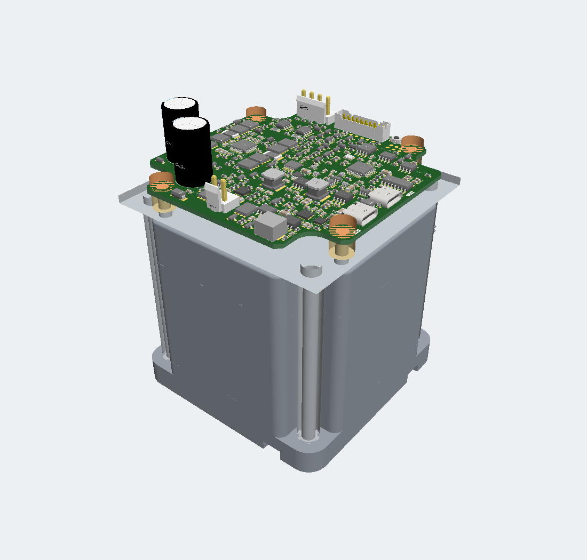
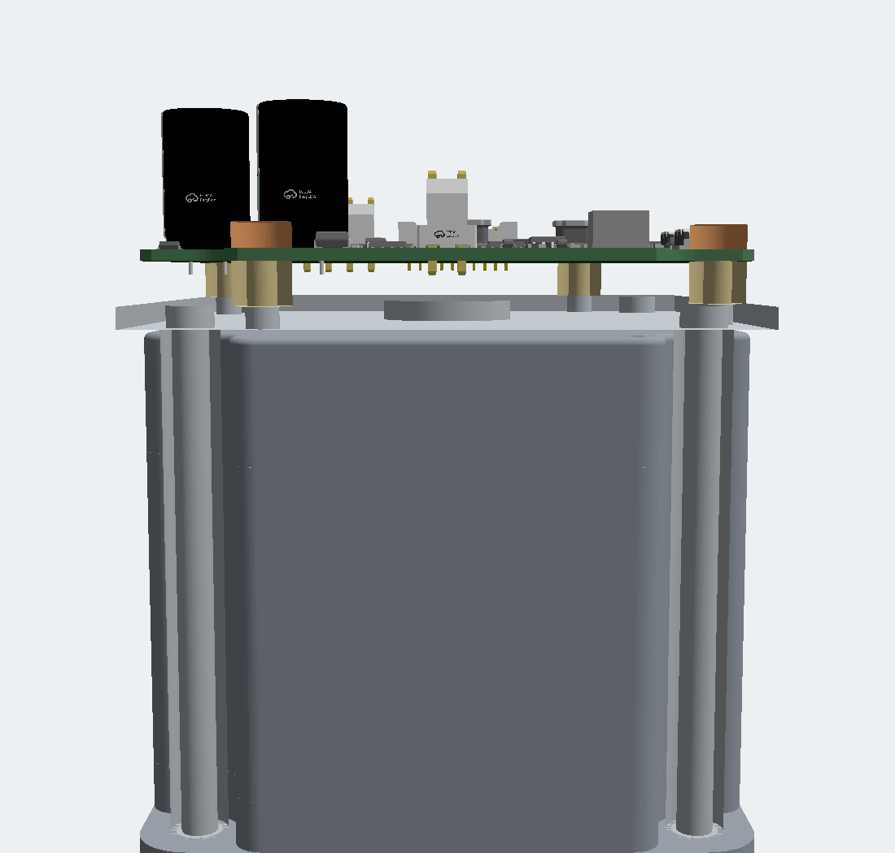

# Ordered 34HS31-6004S1 motor assembly

The user confirmed the ordered motor on 2026-10-11: **STEPPERONLINE 34HS31-6004S1**, Amazon ASIN **B091C83HWF**. This supersedes the earlier QSH8618 selection. The manufacturer specifies 4.8 Nm holding torque, 6 A/phase, an 86 mm frame, 80 mm maximum body length and a single Ø14 × 32 mm front shaft. The phase-current rating is not an approved driver RMS setting.

The [manufacturer STEP](https://files.omc-stepperonline.com/34HS31-6004S1.STEP) is preserved inside `engineering/mechanical/34HS31-6004S1-manufacturer.zip` as `34HS31-6004S1.step`, SHA-256 `675e55f1d50271255bbd058d8c2e867ecced44b194ded1586c63da77ce1c8a19`. The [datasheet](https://files.omc-stepperonline.com/34HS31-6004S1_Full_Datasheet.pdf) is preserved in the same archive; `motor-data.json` records its hash and electrical inputs. The superseded QSH files remain available in Git history. The archive preserves the original manufacturer bytes while keeping the cloud import within its payload limit.

**Direct rear PCB mounting and rear encoder attachment are not established.** The documented mounting interface is the front flange. Existing rear case fasteners are not approved accessory threads; do not remove them or drill the motor based on this preview.

The default hosted 3D view includes the exact motor, routed PCB and adapter proposal. Open `motor-assembly.circuit.tsx` for the source mechanical fit study. It uses `assembly.subassembly` and the manufacturer STEP converted to GLB. Orange cylinders represent maximum screw-head/washer envelopes. No encoder holder or magnet is modeled for this motor. Custom supports are **proposals, not fabrication-released hardware**. `release/circuit.json` remains the authoritative routed PCB view and now also includes the two mechanical models. Its generator rejects any assembly change to the verified board records. Model URLs are pinned to an immutable Git commit and checked against the local CAD hashes; no moving branch URL is used.

The exported assembly is checked for the PCB/motor axis mapping and **10 mm nominal** rear-face-to-PCB-bottom gap. `release/34hs31-6004s1-assembly-proposal.zip` contains the same assembly as an offline GLB.

## PCB screw clearance

The earlier PCB clearance correction moved Q12, Q13, R97, C5, R2 and SW1 on top and repaired their affected copper. This motor-model update does not change the PCB, schematic, mounting-hole positions or routing.

The component-mesh screen uses an 8 mm maximum head/washer diameter and 3.5 mm height above the PCB, with at least 0.5 mm nominal component clearance. Latest exact results are in `motor-assembly-check.json`.

| Hole | Nearest fitted component | Nominal head clearance |
|---|---|---:|
| H1 | Q12 | 0.79 mm |
| H2 | C22 | 1.09 mm |
| H3 | R2 | 0.88 mm |
| H4 | SW1 | 1.38 mm |

These are imported CAD-body clearances, not a tolerance study. Use M4 hardware whose complete head and washer remain within Ø8 mm. A larger washer is outside this check. Assembly tolerances and tool access remain to be qualified.

## Proposed adapter

The drawing specifies four Ø6.5 mm front holes on a **69.6 ±0.2 mm square**. The STEP centers are `(±34.75, ±34.75)` mm, giving 69.5 mm pitch, within that tolerance. Front flange surfaces lie at STEP Z = 0 and 10 mm. The rear face lies at Z = 79.5 mm; the drawing permits an 80 mm maximum body. Four proposed supports run from the rear of the front flange to a separate plate behind the motor.

| Item | Nominal proposal |
|---|---|
| Support posts | Four, Ø8 mm × 70.5 mm; M5 fastening interfaces |
| Rear plate | 85.9 × 85.9 × 3 mm, 6061-T6 aluminum; Ø20 mm center aperture |
| Motor-to-plate gap | 1 mm at the CAD body length |
| PCB standoffs | Four, M4, Ø8 mm × 6 mm |
| PCB bottom above motor rear | 1 + 3 + 6 = **10 mm** nominal |
| PCB hole pattern carried by plate | H1 `(38.4,−24.5)`, H2 `(24.5,38.4)`, H3 `(−38.4,24.5)`, H4 `(−24.5,−38.4)` mm |
| Plate clearance holes | Ø5.5 mm at motor posts; Ø4.5 mm at PCB standoffs |

The mesh screen finds approximately **1.23 mm** minimum nominal clearance between the proposed long posts and the motor case. STEP X/Y map to PCB X/Y; STEP Z is the shaft axis. The motor rear face is placed at PCB Z = −10.8 mm; PCB mid-plane is Z = 0 and its bottom is Z = −0.8 mm. The shaft points away from the board. The board lies parallel to the motor rear face.

At the drawing's 80 mm maximum body length, the nominal 1 mm plate gap becomes 0.5 mm before any other tolerances. The full tolerance stack is unresolved. The posts also share the motor's **front machine-mounting interface**; this has not been approved for the intended machine. Bracket clearance, bolt engagement, post-end design, tolerances, tightening torque, stiffness/vibration, cable strain relief and heat transfer require mechanical review. The GLB shows nominal envelopes, not detailed threads or a qualified fastener kit.

## Encoder attachment unresolved

U18 remains on top, centered on the motor axis. The ordered motor STEP is a single fused mesh. It shows a rear central recess, but does not identify a rotating shaft end, usable pilot bore/thread or approved magnet attachment. A visible rear recess is not proof that a holder can be attached to the rotor.

The old QSH-specific pilot, PEEK holder, magnet dimensions and working-gap calculation are withdrawn. Manufacturer confirmation of rear rotating-shaft access is required before defining a new attachment. If there is no usable rear shaft, an alternative encoder coupling or motor variant must be agreed; the current preview does not resolve that choice.

Any eventual magnet must meet the AS5047P field, alignment and temperature requirements through the top-side sensor stack. Retention, runout and magnetic performance need qualification. Closed-loop operation remains unqualified.

## Before mechanical release

1. Approve use of the front machine-mount holes and finalize bracket/post fasteners, tolerances and cable access.
2. Establish rear rotating-shaft access and an appropriate encoder attachment, or agree an alternative arrangement.
3. Select and qualify the magnet/holder, field and working gap if magnetic feedback is retained.
4. Qualify physical fit, tool access, support strength, retention and vibration.

Motor identity is now confirmed. Driver current/hold settings, rotor/load inertia, speed and stopping duty remain unqualified. These mechanical and operating gates are additional to the existing PD-image, firmware and powered-test holds.

References: [ordered Amazon listing](https://www.amazon.com/dp/B091C83HWF), [manufacturer product](https://www.omc-stepperonline.com/s-series-nema-34-stepper-motor-4-8nm-679-87oz-in-14mm-key-way-shaft-1m-cable-34hs31-6004s1), [AS5047P datasheet](https://look.ams-osram.com/m/d05ee39221f9857/original/AS5047P-DS000324.pdf), [tscircuit subassembly](https://docs.tscircuit.com/elements/assembly-subassembly).
